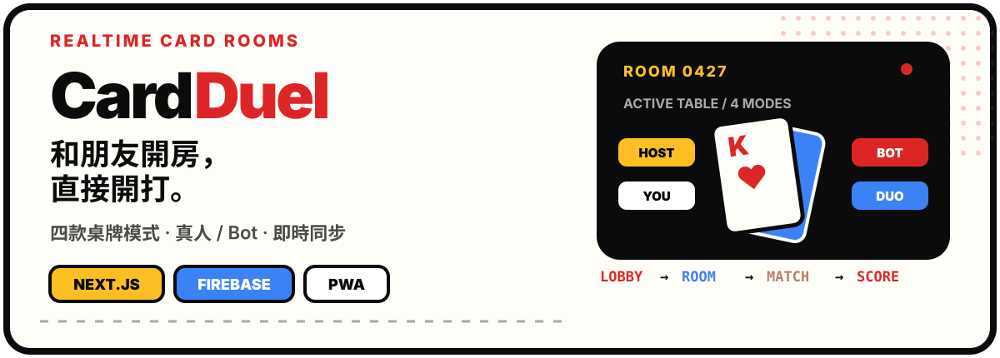
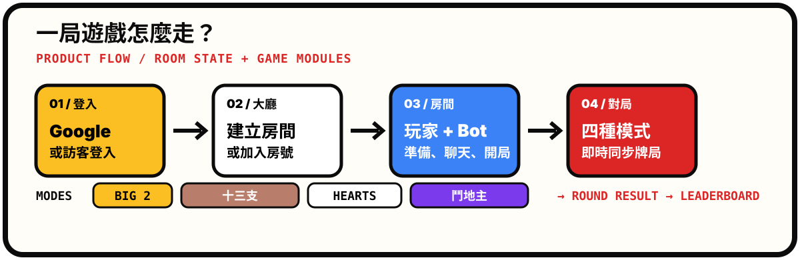

<p align="center">
  
</p>

<p align="center">
  <a href="https://nextjs.org/"></a>
  <a href="https://www.typescriptlang.org/"></a>
  <a href="https://firebase.google.com/"></a>
  <a href="https://developer.mozilla.org/en-US/docs/Web/Progressive_web_apps"></a>
</p>

CardDuel 是一個以 **Next.js App Router**、**Firebase Realtime Database** 與 **Firebase Authentication** 打造的線上多人紙牌平台。玩家可以登入或以訪客身份進入大廳，建立房間、邀請朋友或 Bot，再選擇喜歡的桌牌模式開始對局。

> **目前支援：** 大老二、十三支、傷心小棧、鬥地主。
> **產品方向：** 保留紙牌遊戲的直覺規則，讓房間同步、行動版操作與重新連線都交給平台處理。

## 先看產品流程

<p align="center">
  
</p>

這張圖是根據目前程式結構整理的產品流程示意；實際對局畫面與各模式規則，請以應用程式和對應的遊戲模組為準。

## 四種玩法

| 模式 | 建議人數 | 對局重點 |
| --- | ---: | --- |
| **大老二** | 2–4 人 | 梅花三起手、牌型壓制、特殊五張牌型與積分賽 |
| **十三支** | 2–4 人 | 將 13 張牌排成前／中／後三墩，再進行比牌與結算 |
| **傷心小棧** | 4 人 | 傳牌、跟牌、吃墩、紅心破心與 Shoot the Moon |
| **鬥地主** | 3 人 | 叫分、底牌、地主／農民陣營、炸彈與火箭倍率 |

每個模式都有自己的規則、狀態型別與 Bot 入口；模式名稱、圖示與目標分數則集中在 [src/lib/games/registry.ts](./src/lib/games/registry.ts) 管理。

## 平台能力

### 即時多人房間

- 使用 Realtime Database 的 `onValue` 訂閱房間狀態，讓玩家列表、準備狀態與對局進度同步更新。
- 房間操作以 `runTransaction()` 協調加入、離開、房主移交、出牌與 Bot 行動。
- 房間會記錄 `expiresAt`；進入大廳、建立或加入房間時，會以節流方式清理過期資料。

### 真人、訪客與 Bot

- 支援 Google 登入與訪客登入。
- 房主可以在房間內加入或移除 Bot，四種遊戲各自使用對應的規則與 Bot 邏輯。
- 專案提供 7 款水豚頭像，並在房間與對局畫面中維持一致的角色識別。

### 行動版與 PWA

- 使用 `ResizeObserver` 調整大量手牌的重疊間距，避免窄螢幕跑版。
- 對十三支的三墩牌區、比牌階段與結算排行榜提供行動版排版。
- 透過 manifest、App icon 與 Service Worker 支援加入主畫面與靜態資源快取。

### 排行榜與跨局資料

- Realtime Database 負責房間與對局狀態。
- Cloud Firestore 負責玩家暱稱、累積分數與奪冠次數。
- 各模式在整局結束後更新排行榜；傷心小棧以 0 分提交、保留勝場統計，大廳提供排行榜 Modal 與本地快取。

## 架構速覽

CardDuel 將「共用牌資料」、「單一遊戲規則」與「多人房間協調」分開，讓新增遊戲時不必把規則散落到頁面元件中。

```text
src/
├── app/                         # 路由與頁面流程
├── components/                  # 卡牌、Toast、水豚載入器與各遊戲畫面
├── lib/
│   ├── core/                    # Card、Suit、Rank、GameMode
│   ├── games/
│   │   ├── big2/                # 大老二規則與 Bot
│   │   ├── hearts/              # 傷心小棧規則、狀態與 Bot
│   │   ├── landlord/            # 鬥地主規則、狀態與 Bot
│   │   ├── thirteen/            # 十三支規則與狀態
│   │   └── registry.ts          # 遊戲模式產品設定
│   ├── room/                    # RoomState 與房間服務公開入口
│   ├── firebase.ts              # Firebase 初始化與登入
│   └── leaderboardService.ts    # Firestore 排行榜服務
└── store/                       # Zustand 全域 UI 狀態
```

既有的依賴邊界與新增遊戲檢查清單，請閱讀 [ARCHITECTURE.md](./ARCHITECTURE.md)。

## 快速開始

### 1. 準備 Firebase 設定

在專案根目錄建立 `.env.local`：

```env
NEXT_PUBLIC_FIREBASE_API_KEY=your_api_key
NEXT_PUBLIC_FIREBASE_AUTH_DOMAIN=your_auth_domain
NEXT_PUBLIC_FIREBASE_PROJECT_ID=your_project_id
NEXT_PUBLIC_FIREBASE_STORAGE_BUCKET=your_storage_bucket
NEXT_PUBLIC_FIREBASE_MESSAGING_SENDER_ID=your_messaging_sender_id
NEXT_PUBLIC_FIREBASE_APP_ID=your_app_id
NEXT_PUBLIC_FIREBASE_DATABASE_URL=your_realtime_database_url
```

Firebase Realtime Database 與 Firestore 的規則檔分別位於 [database.rules.json](./database.rules.json) 與 [firestore.rules](./firestore.rules)。

### 2. 安裝依賴並啟動開發伺服器

```bash
npm install
npm run dev
```

開啟 `http://localhost:3000`，即可進入登入頁與遊戲大廳。

### 3. 執行檢查

```bash
npm run lint
npm run test
npm run build
```

其中 `npm run test` 會執行十三支牌型、排墩合法性與計分邏輯測試。

## 部署

### Vercel

Vercel 是目前較直接的部署方式：匯入儲存庫、設定 Firebase 環境變數後即可建置。非 GitHub Pages 的 production build 會保留 Next.js 伺服器輸出，並使用 `next.config.ts` 的 Firebase Auth 同來源 rewrite。

### GitHub Pages

非 Vercel 的 production build 會使用 Next.js static export，並以 `/big2_game` 作為 `basePath`。部署到 GitHub Pages 時，請同步確認 Firebase Authentication 的 Authorized domains 與 Realtime Database／Firestore 規則設定。

## Firebase 資料生命週期

專案以低額度使用為前提設計房間管理：

1. 建立與操作房間時寫入 `createdAt`、`updatedAt`、`expiresAt`。
2. 活躍動作會把過期時間延後 6 小時。
3. 同一瀏覽器每 30 分鐘最多觸發一次過期清理，每次最多處理 20 間房間。
4. 玩家離開時以交易處理房主移交；最後一位玩家離開後刪除房間資料。

## 開源狀態

目前儲存庫尚未附上 `LICENSE` 檔案；若要讓其他人正式使用或再發布，請先補上適用的授權條款。
